# Axess

## Authentication and Authorization for Axum

**Axess** is a modular, policy-driven authentication and authorization middleware library for the [Axum](https://github.com/tokio-rs/axum) web framework. It provides secure, session-based multi-factor authentication and fine-grained authorization via [Cedar Policy](https://cedarpolicy.com/), built around a trait-based design that supports deterministic simulation testing (DST) from the ground up.

Axess was created because the existing landscape of Axum authentication crates — notably [axum-login](https://github.com/maxcountryman/axum-login) — does not easily support multi-factor authentication, exposed too little of its inner workings for convenient extension, and that it couldn't accommodate Relationship-Based Access Control (ReBAC) or Cedar Policy without significant custom work.

> **Status:** Pre-release (`v0.0.14`). Not yet published to crates.io. API is stabilising but may change between minor versions.

---

## Design concepts

Three ideas shape the library's architecture. Understanding them makes the rest of the code easier to reason about.

### Explicit session state machine

Authentication is modelled as an enum — `AuthState` — rather than a boolean flag. The states are `NotAuthenticated`, `PartialAuthn`, `Authenticated`, and `PendingWorkflow`.

The practical consequence is that multi-factor authentication has nowhere to hide: each transition is validated before any mutation takes place, invalid transitions return a typed error, and the session always reflects the exact point in the flow the user has reached. A partially-authenticated session cannot be mistaken for a fully-authenticated one; the type system enforces the distinction. `PartialAuthn` carries the remaining factors, attempt counts, and timestamps as first-class data, not as ad-hoc fields scattered across multiple tables.

This matters most for security code: a state machine with explicit transitions is easier to audit, easier to test for edge cases (what if factor B arrives before factor A has been verified?), and produces clearer audit events.

### Deterministic simulation testing (DST)

Any code that calls `rand::rng()` or `SystemTime::now()` is non-deterministic: two runs of the same test can produce different results. For authentication code this is a problem — session hash generation, OTP window calculations, lockout timing, and nonce creation all depend on time and randomness.

Axess uses injectable `SecureRng` and `Clock` traits throughout. In production, `SystemRng` and `SystemClock` delegate to the OS. In tests, `MockRng::new(seed)` produces the same byte sequence for the same seed, and `MockClock` can be advanced to any timestamp. This makes it possible to write a deterministic test for "what happens if the user submits a TOTP code from the previous time step" without sleeping or depending on the system clock.

`MockBackend` and `MockRegistry` extend this to the full authentication flow — a complete login including session registry interactions can be exercised without a database.

### Cedar Policy for authorization

Most authorization in web services is implemented as imperative checks in handler code: `if user.roles.contains("admin")`. This works for simple cases but does not compose well: the rules are scattered across the codebase, RBAC and ownership-based checks use different patterns, and there is no schema to validate that the entities you are passing to the check actually have the attributes the policy assumes.

Cedar Policy is a declarative policy language with a formal semantics. Policies live in `.cedar` files, are validated against a `.cedar.json` schema at startup, and are evaluated by a Cedar runtime that is deny-by-default. The same policy file can express RBAC (`principal in Role::"finance-viewer"`), ABAC (`context.ip_address like "192.168.*"`), and ReBAC (`resource.owner == principal`) in a single language. Any evaluation error — malformed entity UID, attribute missing from schema, type mismatch — produces `Deny`, never `Allow`.

In Axess, `PolicyStore` is loaded once at startup and is `Send + Sync`. Entity sets are built per-request from the backend and passed to Cedar for evaluation. The policies themselves remain outside the Rust code, which means they can be reviewed, tested, and audited independently of the application logic.

---

## Workspace layout

| Crate | Purpose |
|---|---|
| `axess` | Public API surface — middleware builder, re-exports, feature gates |
| `axess-core` | Core types, traits, session orchestrator, Cedar authz integration |
| `axess-factors` | Authentication factor implementations (password, TOTP, HOTP) |
| `axess-macros` | Procedural macros for route-level authentication guards |
| `examples/sqlite` | Reference SQLite + tower-sessions example application |

---

## Key capabilities

- **Multi-factor authentication** — sequential factor verification (password → TOTP → HOTP → email OTP); factors are composable into methods, methods are scoped per tenant or per user
- **Cedar Policy authorization** — RBAC, ABAC, and ReBAC from a single policy language; fail-closed by default
- **Session lifecycle management** — session ID cycling on authentication (prevents fixation), registry-based forced logout per user or tenant, hash-bound session validation
- **Multi-tenancy** — three-tier scope hierarchy: Global → Tenant → User; factor and method configuration can vary at each level
- **Extensible backends** — implement `AuthnBackend` to connect any database or identity provider
- **Deterministic simulation testing** — injectable `SecureRng` and `Clock` traits; `MockBackend`, `MockRng`, and `MockRegistry` included for reproducible unit tests
- **Audit logging** — all authentication state transitions emit structured `AuthEventRecord` entries via the backend trait

---

## Installation

Axess is not yet published to crates.io. Add it as a path or git dependency:

```toml
[dependencies]
axess = { path = "../axess" }

# or, once published:
# axess = { version = "0.1", features = ["authn", "authz"] }
```

### Feature flags

| Feature | What it enables | Default |
|---|---|---|
| `authn` | Authentication layer, extractors, session middleware | yes |
| `authz` | Cedar Policy authorization, `PolicyStore`, entity builders | yes |
| `admin` | Admin backend trait + handlers (user/tenant management) | no |
| `request_id` | UUID-based request ID injected into response headers | no |
| `trace_id` | OpenTelemetry span ID propagation via headers | no |
| `memory` | In-memory session registry (dev/test) | no |
| `valkey` | Valkey/Redis-compatible encrypted session backend | no |
| `full` | All of the above | no |

---

## Quick start

```rust
use axess::{AuthnServiceBuilder, AuthSession, SessionRegistryStore, SystemRng, login_required};
use axum::{Router, routing::get};
use tower_sessions::SessionManagerLayer;
use tower_sessions_sqlx_store::SqliteStore;
use sqlx::SqlitePool;
use std::sync::Arc;
use tokio::net::TcpListener;

// Type alias — avoids repeating the three type parameters everywhere.
type Session = AuthSession<OurBackend, SessionRegistryStore<SqliteStore>, SystemRng>;

#[tokio::main]
async fn main() -> anyhow::Result<()> {
    let pool = SqlitePool::connect("sqlite:app.db").await?;

    // Session store (tower-sessions) + registry (axess invalidation layer).
    let session_store = SqliteStore::new(pool.clone());
    let session_layer = SessionManagerLayer::new(session_store.clone());
    let registry = Arc::new(SessionRegistryStore::new(session_store, 3600, None, None));

    // Your backend: connects to the DB, validates credentials, manages factor state.
    let backend = Arc::new(OurBackend::new(pool));

    let auth_layer = AuthnServiceBuilder::new(backend, session_layer)
        .with_session_registry(registry)
        .build();

    // Protected routes — unauthenticated requests redirect to /login.
    let protected = Router::new()
        .route("/dashboard", get(dashboard_handler))
        .route_layer(login_required!(Arc<Session>, "/login"));

    let public = Router::new()
        .route("/", get(index_handler))
        .route("/login", get(login_page).post(login_submit))
        .route("/logout", get(logout_handler));

    let app = Router::new()
        .merge(protected)
        .merge(public)
        .layer(auth_layer);

    axum::serve(TcpListener::bind("0.0.0.0:3000").await?, app).await?;
    Ok(())
}
```

See [`examples/sqlite`](examples/sqlite/) for a complete working example including backend implementation, factor setup, and route handlers.

---

## Authentication

### Core concepts

**Authentication method** — a named, ordered sequence of factors that a user must complete. A method belongs to a scope (global, tenant, or user).

**Factor** — a single verification step. Supported kinds:

| Kind | Crate | Notes |
|---|---|---|
| `Password` | `password-auth` (argon2) | Constant-time verification |
| `Totp` | `totp-rs` | RFC 6238; configurable period and window |
| `Hotp` | `libreauth` | RFC 4226; counter-based, constant-time |
| `EmailOtp` | _(application-provided)_ | Code generation/delivery is application-specific |

**Session state machine** — the `AuthState` enum models the session lifecycle:

```
NotAuthenticated → PartialAuthn → Authenticated
                                  ↓ (if post-auth workflow required)
                              PendingWorkflow
```

`PartialAuthn` tracks which factors remain, attempt counts, and last attempt timestamps. State transitions are validated before any mutation — invalid transitions return `AuthError`.

### Security properties

- **Session fixation protection** — session ID is cycled immediately after all factors pass; the old ID is invalidated in the registry before the new one is committed.
- **Replay protection** — session state is bound to a SHA-256 hash; any tampering or replay of an old session token is detected.
- **Exponential lockout** — configurable attempt limit per factor; exceeding it invalidates the session and applies a back-off record via the backend.
- **TOTP replay protection** — the last-used time step is stored and enforced; the same OTP cannot be reused within its validity window.
- **Constant-time comparisons** — HOTP verification uses `subtle::ConstantTimeEq`; password verification delegates to `password-auth` which uses constant-time argon2 comparison.
- **Audit trail** — every state transition emits a structured `AuthEventRecord` (event type, factor kind, success/failure, timestamps) via `AuthnBackend::log_event`.

### Implementing `AuthnBackend`

Your backend is the bridge between Axess and your data layer. It must implement:

```rust
#[async_trait]
impl AuthnBackend for MyBackend {
    type TenantId = Uuid;
    type UserId = Uuid;
    type AuthId = Uuid;  // identifies a specific factor/method instance

    // Resolve tenant and user from a login credential identifier
    async fn get_tenant(&self, id: &Self::TenantId) -> Result<Option<Tenant>, ...>;
    async fn get_user(&self, id: &Self::UserId) -> Result<Option<User>, ...>;
    async fn get_user_by_identifier(&self, credential: &str) -> Result<Option<User>, ...>;

    // Factor and method state queries (scope-aware)
    async fn get_factor_state(&self, scope: AuthnScope<...>, kind: Kind) -> Result<...>;
    async fn get_method_for_scope(&self, scope: AuthnScope<...>) -> Result<...>;

    // Persist factor configuration after setup
    async fn upsert_factor_state(&self, ...) -> Result<...>;

    // Audit
    async fn log_event(&self, record: AuthEventRecord<...>) -> Result<...>;
}
```

See [`axess-core/src/authn/backend.rs`](axess-core/src/authn/backend.rs) for the full trait definition and [`examples/sqlite/src/models`](examples/sqlite/src/models/) for a complete SQLite implementation.

---

## Authorization

Authorization uses [Cedar Policy](https://cedarpolicy.com/) — a policy language that natively supports RBAC, ABAC, and ReBAC. Axess provides the evaluation plumbing; you implement `AuthzEntityProvider` and author the policies.

### Setup

```rust
use axess::authorization::{AuthzStore, PolicyStore};
use std::sync::Arc;

// 1. Compile policy + schema once at startup.
let policy_store = Arc::new(PolicyStore::from_text(
    include_str!("policies/app.cedar"),
    include_str!("policies/app.cedar.json"),
)?);

// 2. Wrap in AuthzStore with your entity provider and Cedar namespace.
let authz = Arc::new(AuthzStore::new(
    policy_store,
    Arc::new(MyEntityProvider::new(db.clone())),
    "MyApp",    // Cedar namespace — must match your .cedar schema
));
authz.validate()?;  // assert provider ↔ schema at startup
```

### Checking a permission

```rust
async fn view_ledger(
    State(state): State<AppState>,
    session: AuthSession<OurBackend, OurRegistry, SystemRng>,
    Path(ledger_id): Path<Uuid>,
) -> Result<impl IntoResponse, AppError> {
    let user_id = session.get_user_id().ok_or(AuthzDenied)?;

    // Fail-closed: entity error or policy deny → Err(AuthzDenied) → 403
    let authz = state.authz.for_user_id(&user_id.to_string())?;
    authz.require("ViewLedger", &ledger_id).await?;

    // ...handler body
}
```

With ABAC context (MFA requirement, IP restriction):

```rust
use axess::authorization::{StandardRequestContext, ip_from_headers};

let ctx = StandardRequestContext {
    mfa_verified: session.is_mfa_complete(),
    ip_address: ip_from_headers(request.headers()),
};
let authz = state.authz.for_user_id_with_context(&user_id, ctx)?;
authz.require("PostJournalEntry", &ledger_id).await?;
```

### Implementing `AuthzEntityProvider`

Your entity provider builds the Cedar entity graph for each check:

```rust
#[async_trait]
impl AuthzEntityProvider for MyEntityProvider {
    type ResourceId = Uuid;
    type Error = sqlx::Error;

    async fn entities_for(
        &self,
        principal: &EntityUid,
        resource_id: &Uuid,
        _action: &EntityUid,
    ) -> Result<Entities, sqlx::Error> {
        // Load user's roles, the resource, build cedar_policy::Entities
        // Must include: principal (with role parents), role entities, resource
        todo!()
    }

    fn resource_uid(&self, id: &Uuid) -> Result<EntityUid, AuthzError> {
        EntityUid::from_str(&format!(r#"MyApp::Ledger::"{id}""#))
            .map_err(|e| AuthzError::InvalidEntityUid(e.to_string()))
    }
}
```

### Policy model

The Cedar namespace is configured per application via `AuthzStore::new`. Entity UID builders are methods on `AuthzStore`: `store.user_uid(id)`, `store.role_uid(name)`, `store.action_uid(name)`, `store.tenant_uid(id)`, `store.entity_uid(type_name, id)`.

```cedar
// RBAC: role membership
permit (
    principal in MyApp::Role::"finance-viewer",
    action == MyApp::Action::"ViewLedger",
    resource is MyApp::Ledger
) when { principal.tenant == resource.tenant };

// ReBAC: ownership
permit (
    principal is MyApp::User,
    action in [MyApp::Action::"ViewLedger", MyApp::Action::"PostEntry"],
    resource is MyApp::Ledger
) when {
    principal.tenant == resource.tenant &&
    resource has owner && resource.owner == principal
};

// ABAC: require recent MFA for sensitive writes
permit (
    principal in MyApp::Role::"finance-member",
    action == MyApp::Action::"PostJournalEntry",
    resource is MyApp::Ledger
) when {
    context.mfa_verified == true
};
```

---

## Testing

Axess is designed for deterministic, reproducible tests via injectable abstractions:

```rust
use axess_core::utils::testing::mock_random::MockRng;
use axess_core::utils::testing::mock_backend::MockBackend;

let rng = MockRng::new(42);          // deterministic randomness
let backend = Arc::new(MockBackend::new());
let registry = Arc::new(MockRegistry::new());

let session = AuthSession::new(backend, registry, rng, /* ... */);
```

`MockRng::new(seed)` produces identical byte sequences for the same seed, ensuring session hash generation and nonce creation are reproducible across test runs. `MockBackend` is an in-memory store with the full `AuthnBackend` interface.

---

## Macros

Three procedural macros are available from `axess-macros`:

```rust
// Redirect unauthenticated requests to /login with ?next= set
.route_layer(login_required!(Arc<Session>, "/login"))

// Restrict to sessions in the PartialAuthn state (mid-MFA)
.route_layer(require_partial_authn!(Arc<Session>, "/login"))

// Restrict by arbitrary async predicate; return 401 or redirect
.route_layer(predicate_required!(Arc<Session>, my_async_predicate, "/forbidden"))
```

---

## Authentication flow

```mermaid
---
title: Authentication Flow
---
flowchart LR
    Start((Start)):::starter --> LoginForm[/Form:</br>Login Page/]:::form & SignupForm[/Form:</br>Signup Page/]:::form
    AuthFailure((Authentication</br>Failed)):::failure -->|Not Authenticated| End((End)):::ender
    AuthFailure -->|Re-route to Login| LoginForm
    AuthnSuccess -->|Authenticated| End

    Login:::process
    Signup:::process
    FactorSetup:::process

    subgraph Login [ User Login Flow ]
        direction LR
        LoginForm -->|Submit Form| ResolveUserTenant((Resolve</br>Tenant & User</br>from Backend))
        ResolveUserTenant -->|Tenant/User Not Found| LoginForm
        ResolveUserTenant -->|Ok| GetAuthMethod((Query Auth Method</br>for Scope))
        GetAuthMethod -->|No Method Found| LoginForm
        GetAuthMethod -->|Ok| StartAuthSession((Start Auth Session</br>Set State: PartialAuthn</br>Register in Registry))
        StartAuthSession --> ValidateState{Validate</br>Session State</br>Transition}
        ValidateState -->|Invalid State| AuthFailure
        ValidateState -->|Valid| QueryFactorState((Query Factor State</br>from Backend</br>for Scope))
        QueryFactorState --> VerifyCredentials((Verify Credentials</br>vs Stored Config))
        VerifyCredentials -->|Ok| ApplyFactor((Apply Factor</br>Update State))
        VerifyCredentials -->|Failed| FailedFactorVerification{Failed</br>Factor Verification</br>try again?}
        ApplyFactor --> VerifyMoreFactors{More Factors</br>to Verify?}
        VerifyMoreFactors -->|Yes| RedirectToVerify((Redirect to</br>Factor</br>Verification))
        RedirectToVerify --> MfaForm[/Form:</br>Verify Next Factor/]:::form
        MfaForm -->|Submit Form| ValidateState
        VerifyMoreFactors -->|No, Done!| CycleSessionID((Cycle Session ID</br>for Security))
        CycleSessionID --> GenerateHash((Generate</br>Session Hash))
        GenerateHash --> UpdateRegistry((Update Session</br>in Registry))
        UpdateRegistry --> InvalidateOldSession((Invalidate Old</br>Session ID))
        InvalidateOldSession --> SaveSessionData((Save Session Data</br>State: Authenticated))
        SaveSessionData --> CompletedLogin(Login Successful):::success
        FailedFactorVerification -->|Yes, Retry| QueryFactorState
        FailedFactorVerification -->|No, Max Attempts| ExponentialLockout((Apply Exponential</br>User Lockout</br>Invalidate Session))
        ExponentialLockout -->|Cancel Session| AuthFailure
        CompletedLogin --> AuthnSuccess((Authentication</br>Completed)):::success
    end

    subgraph FactorSetup [ Authn Factor Setup Flow ]
        direction LR
        VerifyMoreFactors -->|Yes, Factor</br>Needs Setup| CheckAuthenticated{User Already</br>Authenticated?}
        CheckAuthenticated -->|No| AuthFailure
        CheckAuthenticated -->|Yes| RedirectToSetup((Redirect to</br>Factor Setup))
        RedirectToSetup --> SetupNextExpectedFactor[/Form:</br>Setup Expected Factor/]:::form
        SetupNextExpectedFactor -->|Submit Form| ValidateSetupForm((Validate</br>Setup Form))
        ValidateSetupForm --> EvaluateFactorSetup{Evaluate</br>Factor Setup</br>Credentials}
        EvaluateFactorSetup -->|Ok| UpsertFactorState((Upsert Factor State</br>to Backend</br>with Config))
        UpsertFactorState --> SetupMoreFactors{More Factors</br>to Setup?}
        EvaluateFactorSetup -->|Failed| FailedFactorSetup{Failed</br>Factor Setup</br>Try Again?}
        FailedFactorSetup -->|Retry| RedirectToSetup
        FailedFactorSetup -->|Cancel Flow| AuthFailure
        QueryFactorState -->|Factor State</br>Not Found| CheckAuthenticated
        SetupMoreFactors -->|Yes| RedirectToSetup
        SetupMoreFactors -->|No| RedirectToVerify
    end

    subgraph Signup [ User Signup Flow — Not Yet Implemented ]
        direction LR
        SignupForm -->|Submit Form| AttemptCreateUserAccount(Create</br>New User Account</br>in Backend)
        AttemptCreateUserAccount -->|Failed| SignupForm
        AttemptCreateUserAccount -->|Ok| GenerateSignupVerificationEmail((Generate</br>Verification Email))
        GenerateSignupVerificationEmail -->|Send Email| UserEmailInbox[User's Email Inbox</br>Verification Link]
        UserEmailInbox --> VerifyEmail[/Form:</br>Verify Email/]:::form
        VerifyEmail -->|Submit Form| CreateUserDefaultAuth((Setup</br>Default Authn</br>Method))
        CreateUserDefaultAuth --> SetupMoreFactors
        SetupMoreFactors -->|No, Done!| CompletedSignup(Signup Successful):::success
        CompletedSignup --> AuthnSuccess
    end

classDef ender fill:#ffffff,stroke:#ffa0a0,stroke-width:0.4em,color:#ffa0a0,font-size:1.5em;
classDef starter fill:#ffffff,stroke:#000,stroke-width:3px,color:#00a000,font-size:1.5em;
classDef form fill:#a0d0ff,stroke:#000,stroke-width:3px,color:#0000bb;
classDef success stroke:#a0ffa0,stroke-width:3px,color:#a0ffa0;
classDef failure stroke:#ffa0a0,stroke-width:3px,color:#ffa0a0;
classDef process align:left;
```



---

## Known limitations

- **Valkey backend** (`feature = "valkey"`) — the AES-256-GCM encrypted session store is partially implemented. Do not use in production until complete.
- **In-memory session store** (`feature = "memory"`) — stub only; not yet functional. Use `MockRegistry` for testing instead.
- **Signup flow** — the flow is documented and modelled in the state machine but not yet implemented in the library itself.
- **FIDO2 / passkeys** — on the roadmap; not yet implemented.
- **Session expiry** — currently a module-level constant (3600 s). Will become a configuration parameter.
- **Application-specific roles** — role name constants and taxonomies belong in the consuming application. The library provides Cedar evaluation infrastructure only.

---

## Security

- No `unsafe` code (`#![forbid(unsafe_code)]` enforced across all crates).
- All cryptographic operations delegate to audited crates (`password-auth`, `totp-rs`, `libreauth`, `aes-gcm`).
- Constant-time comparisons used throughout factor verification.
- Cedar Policy is deny-by-default: any evaluation error produces `Deny`.

**Reporting vulnerabilities:** email security@gnomes.ch or open a private GitHub issue.

Please review Cedar policies and backend configuration for least-privilege before deploying. MFA is strongly recommended for any application handling sensitive data.

See [SECURITY.md](./SECURITY.md) for the full disclosure policy.

---

## License

[MIT](./LICENSE) — Gnomes, 2024–2025.
