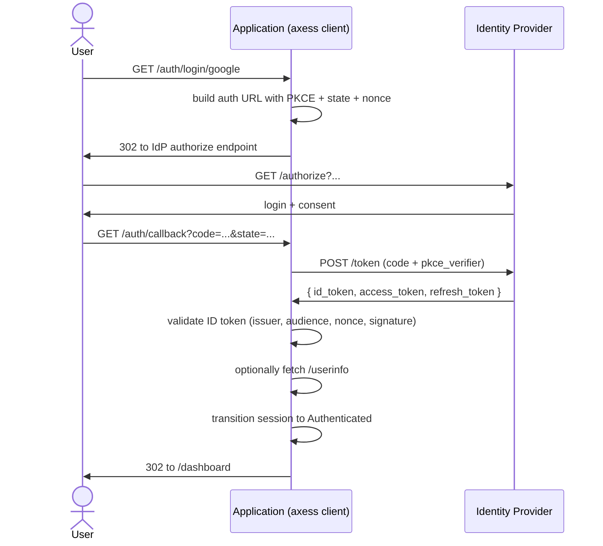

# OAuth 2.0 and OIDC

Federated login through an Identity Provider you do not control is
the most common reason adopters reach for OAuth. The user has a
Google account, an Okta account, a corporate Azure AD account, and
you accept a login from any of them rather than asking
the user to invent and remember another password. The mechanism is
OAuth 2.0 for the authorisation flow and OpenID Connect for the
identity assertion layered on top. The division of labour is the thing
to hold on to: what axess wires up, and what your integration code still
owns.

The feature flag is `oauth` (off by default), enabled with
`features = ["oauth", "jwt-rust-crypto"]` on the `axess` facade. `oauth`
transitively enables `oidc` (the discovery and JWKS-cache machinery) and `jwt`
(the ID token validator), and `jwt` needs a crypto backend named beside it:
`jwt-rust-crypto` (pure Rust) or `jwt-aws-lc` (FIPS-capable, needs a C
toolchain).

Axess supports generic OIDC-based external login and SSO, including standard providers such as Google and Microsoft Entra ID when configured with the appropriate issuer metadata and client credentials. SAML / Shibboleth federation is not currently supported out of the box.

## The shape of the flow

A federated login involves the user, the application (the OAuth
client, in OAuth language, which is axess), and the Identity Provider
(the OAuth server, which is the third-party IdP). The flow is the
authorisation code grant with PKCE, which is what every modern OIDC
deployment uses.



Axess owns six pieces of the flow:

- the PKCE verifier and challenge
- the CSRF state, generated and bound
- the OIDC nonce, generated and bound
- discovery of the IdP's endpoints and signing keys
- the token exchange
- ID token validation: signature, audience, nonce, and `azp` when the
  audience is multi-valued

Your integration owns three:

- the redirect to the IdP authorize URL
- the callback handler that picks up the code
- mapping validated claims onto a user record in your identity store

## Configuring a provider

You do not implement the trait; `discover` builds a provider from the IdP's own document.

### The provider

`OAuthProvider` is the trait that represents an IdP. The trait is
asynchronous because every method may need to fetch JWKS, perform
discovery, or hit the token endpoint. Adopters do not implement this
trait themselves under normal circumstances; the
`OAuthProviderConfig` constructor in `axess-factors` produces a
provider from a discovery URL plus client credentials, and the
returned provider implements the trait.

```rust,ignore
let provider = OAuthProviderConfig::discover(
    "https://accounts.google.com/.well-known/openid-configuration",
    client_id,
    client_secret,
    "https://your-app.example.com/auth/callback/google".parse()?,
)
.await?;
```

`discover` fetches the IdP's discovery document, validates it
contains the endpoints axess needs (authorization, token, JWKS,
userinfo, sometimes end-session), constructs a `Discovery` value, and
sets up the JWKS cache against the IdP's signing-key endpoint. The
cache is single-flight (concurrent JWKS misses dedupe to one request)
and debounced (the cache refuses to refresh more often than once
every few seconds, defeating a denial-of-service that triggers
constant JWKS fetches).

The configuration record carries four things:

- The client id and secret, both provisioned at the IdP.
- The redirect URI, where the IdP sends the user after authentication.
- The ceremony timeout: how long the intermediate state on the session
  may live before the flow has to restart.
- The scopes to request. `openid` and `profile` at minimum; `email` if
  you need the user's email address; `offline_access` if
  it needs a refresh token to keep acting as the user after the
  initial session expires.

### Multiple providers

A common shape is to offer login with several IdPs side by side
(Google, GitHub, Microsoft). Each provider is its own
`OAuthProvider` instance constructed at startup; your code
registers them under a `provider_name` key. The login URL carries
the provider name (`GET /auth/login/google`); the callback URL also
carries the name (`GET /auth/callback/google`). Axess dispatches to
the right provider per request.

A per-tenant variation is also common: each tenant's users federate
against the tenant's own IdP (an Okta workspace, an Azure AD
directory). The provider name in this case is the tenant slug; the
provider is constructed at tenant provisioning time (or lazily, on
first use) and cached. The scope hierarchy chapter covers the
pattern for storing per-tenant configurations.

## The login flow

The three steps a user passes through, in order.

### Begin the login

The handler that starts the federated login transitions the session
into a state that holds the PKCE verifier, the CSRF state, and the
nonce, and returns a redirect to the IdP's authorize URL with those
values bound in.

```rust,ignore
use axess::{AuthnService, AuthSession, OAuthLoginOptions};
use axum::response::{IntoResponse, Redirect};

async fn begin_oauth_login(
    session: AuthSession,
    State(service): State<Arc<AuthnService<...>>>,
    Path(provider_name): Path<String>,
) -> impl IntoResponse {
    match service
        .begin_oauth_login(&session, &provider_name, OAuthLoginOptions::default())
        .await
    {
        Ok(auth_url) => Redirect::to(auth_url.as_str()).into_response(),
        Err(e) => (StatusCode::BAD_REQUEST, format!("{e}")).into_response(),
    }
}
```

`begin_oauth_login` does three things:

1. Generates the PKCE verifier through `SecureRng` and derives the S256
   challenge that travels in the authorize URL.
2. Generates the CSRF state and the OIDC nonce, also through `SecureRng`,
   and stores all three in the session's intermediate state.
3. Composes the authorize URL from the client id, redirect URI, scopes,
   challenge, state and nonce, and returns it.

The redirect URI passed at this step must exactly match the one
registered with the IdP at provisioning time. A mismatch is the
single most common reason a federated login fails out of the box.

### Handle the callback

The IdP, on successful user authentication and consent, redirects the
user to the registered redirect URI with a `code` and a `state` query
parameter. The application's callback handler picks these up,
verifies the state matches what was stored on the session (defeating
CSRF), and calls into axess to perform the token exchange.

```rust,ignore
async fn finish_oauth_login(
    session: AuthSession,
    State(service): State<Arc<AuthnService<...>>>,
    Path(provider_name): Path<String>,
    Query(callback): Query<CallbackQuery>,
) -> impl IntoResponse {
    match service
        .finish_oauth_login(&session, &provider_name, &callback.code, &callback.state)
        .await
    {
        Ok(_authenticated) => Redirect::to("/dashboard").into_response(),
        Err(e) => (StatusCode::UNAUTHORIZED, format!("{e}")).into_response(),
    }
}

#[derive(serde::Deserialize)]
struct CallbackQuery {
    code: String,
    state: String,
}
```

`finish_oauth_login` does seven things:

1. Reads the PKCE verifier, CSRF state and nonce from the session's
   intermediate state.
2. Cross-checks the supplied state against the stored one, returning
   `OAuthError::CsrfMismatch` if they disagree.
3. POSTs to the IdP's token endpoint with the code, verifier, client id
   and client secret.
4. Extracts the ID token, access token and optional refresh token.
5. Validates the ID token: signature against the cached JWKS, issuer,
   audience, nonce, expiry, and `azp` when the audience is multi-valued.
6. Optionally fetches userinfo to supplement the ID token claims.
7. Transitions the session to `Authenticated`, or to `PendingWorkflow`
   if the federated flow is one step of a longer ceremony such as signup.

If any of the seven steps fails, the function returns an
`OAuthError` variant naming what failed. The session does not
transition; the intermediate state is cleared (to prevent replay);
the callback handler can render an error.

### ID token validation

The ID token validation is where most of the security of an OIDC
integration lives. Axess performs the full set of checks RFC 6749
and OpenID Connect Core 1.0 require; the integration code does not
have to write them. The checks are:

**Signature verification** against the IdP's JWKS. The
cache holds the current signing keys; if the ID token's `kid` header
does not match a cached key, the cache refreshes (subject to the
single-flight and debounce protections). A signature that fails
against the refreshed keys produces `OAuthError::IdTokenValidation`,
carrying the underlying reason as a string; a `kid` the refreshed JWKS
still does not contain produces `OAuthError::UnknownKid` instead, which
is the one to alert on because it usually means the IdP rotated keys in
a way the cache cannot follow.

**The issuer check.** The ID token's `iss` claim must
exactly match the discovery document's `issuer` field. A mismatch
indicates either a misconfigured IdP, a discovery-document substitution
attack, or an attempt to replay an ID token from a different issuer;
all three produce `OAuthError::IdTokenValidation`. There is no
per-check variant: the enum carries one validation error whose string
names which claim failed, so match on the variant and log the string
rather than branching on the reason.

**The audience check.** The ID token's `aud` claim must
contain the client's registered client id. If `aud` is a single
value, the check is straightforward. If `aud` is an array (which
happens when the IdP issues tokens valid for multiple clients), the
check ensures the client id is in the array, *and* additionally
enforces the `azp` (authorized party) check: the `azp` claim must
exist and equal the client id, regardless of the array's contents.
The `azp` check defeats a class of attacks where an ID token issued
for one client is replayed against a different client whose id is
also in the audience array.

The fourth is the nonce check. The ID token's `nonce` claim must
exactly match the nonce that was generated at `begin_oauth_login`
time and stored in the session. The nonce defeats ID token replay:
an attacker who captures an ID token cannot reuse it against the
same client because the session-bound nonce will not match on a
later login.

The fifth is the expiry check. The ID token's `exp` claim must be
in the future at the moment of validation, with a small clock-skew
allowance. The clock comes from the injected `Clock` trait, so DST
tests can exercise expiry handling deterministically.

The sixth is `iat` (issued-at) bounds. The token must have been
issued within the last few minutes; tokens older than that indicate
replay. The bound is configurable but defaults to five minutes,
which matches what RFC 7519 implementations typically use.

## Logging out

Two mechanisms, driven from opposite ends.

### Back-channel logout

When the IdP supports OIDC back-channel logout, the IdP sends a POST
to a registered logout endpoint at your application with a
`logout_token`. The application validates the token and, on success,
revokes the user's session.

The validation is similar to ID token validation but slightly
different: the audience and issuer checks apply, the `azp` check
applies when audience is multi-valued, and an additional check on
the `events` claim verifies the token is a back-channel logout token
(the URI `http://schemas.openid.net/event/backchannel-logout` must be
present). Axess implements this through `OAuthProvider::verify_logout_jwt`,
which returns the claims on success.

The size cap on the logout token is eight kilobytes, the `iat` bound
is five minutes, and the clock-skew tolerance is sixty seconds. The
caps protect against denial-of-service through oversize tokens; the
bounds defeat replay of a captured logout token after a meaningful
delay.

### RP-Initiated Logout

The opposite direction is RP-Initiated Logout: you
initiates a logout that propagates to the IdP, so the user is logged
out of the IdP session as well as your own. Axess
constructs the end-session URL through
`OAuthProvider::build_end_session_url`, which takes the ID token
hint (the user's last issued ID token, signed by the IdP), an
optional `post_logout_redirect_uri` (where to send the user after
logout), and an optional state value.

The `post_logout_redirect_uri` must be on an allowlist that the
application configures. The allowlist exists to defeat open-redirect
attacks: an attacker who can manipulate the redirect URI could send
the user to an arbitrary external site after logout, which is the
shape of a phishing setup. The allowlist is a small explicit list of
allowed URIs; anything else is rejected at `build_end_session_url`
time.

## Threat model

OAuth and OIDC together are robust against a handful of attacks
when the implementation does the validations above correctly.

Against CSRF on the callback: the state parameter binds the callback
to the session that started the login. An attacker who tricks a user
into hitting the callback URL with a stolen code cannot complete the
login because the state will not match.

Against ID token replay: the nonce binds the ID token to the
session's login attempt. An ID token captured by an attacker cannot
be replayed against a different session.

Against ID token forgery: signature validation against the JWKS
catches an attacker who synthesises an ID token without the IdP's
signing key.

Against audience confusion (an ID token issued for one client used
against another): the audience check plus the `azp` check on
multi-element audiences catch this.

Against authorization code interception: PKCE binds the code to the
verifier you generated. An attacker who intercepts the
code cannot exchange it without the verifier.

Against open-redirect phishing on logout: the
`allowed_post_logout_redirect_uris` allowlist catches an attacker
who tries to manipulate the redirect URI.

The attacks OAuth and OIDC do not defend against are the ones FIDO2
defends against (real-time phishing of the IdP login page itself)
and the ones that depend on the IdP's own security posture (a
compromised IdP issues compromised tokens, and no client-side check
catches that). The defence for the latter is operational: monitor
which IdPs you accept, audit periodically, and rotate
the registered client secret if the IdP suffers a breach.

## Troubleshooting

A few failure modes recur during initial integration.

If the callback returns an error about state mismatch, the most
likely cause is that the user took longer than the ceremony timeout
to complete the IdP login. The intermediate state on the session has
expired and the state value is no longer recoverable. Increasing
the ceremony timeout (a generous fifteen minutes is reasonable) is
the fix.

If the token exchange returns an invalid-client error, the client id
or secret in `OAuthProviderConfig` does not match what the IdP has
registered. The most common variant is using a public-client id at
the IdP while configuring axess with a confidential-client expectation
(or vice versa). Check the IdP's client registration page.

If the ID token validation returns an audience mismatch on an IdP
that supports multiple clients, the `aud` claim is probably an
array and the `azp` claim is missing. Some IdPs do not emit `azp`
when they should; configuring the IdP to issue `azp` is the fix.
Axess deliberately refuses to bypass the `azp` check because doing
so would open the audience-confusion attack.

If the userinfo endpoint returns a 401 after a successful token
exchange, the access token's scopes do not include the ones the
userinfo endpoint requires. The fix is to add the required scopes
(typically `profile` and `email`) to the `scopes` configuration.

## Further reading

*FAPI 2.0* covers the financial-grade extensions that layer on top of
the OAuth provider for regulated deployments: PAR (pushed
authorization requests, which send the authorize parameters
server-to-server instead of through the browser), DPoP (demonstrating
proof of possession, which binds a token to a key the client holds),
and JARM (JWT-secured authorization response mode, which signs the
IdP's response back to the client).
*Workload identity overview* covers the inbound resolver side of
the same machinery, where your service is the OAuth server
accepting tokens issued by federated workload-identity systems.
*Local IdP* covers the in-process IdP, both production `LocalIdp`
for workload-identity issuance and the `LocalIdpFixture` that mints
test tokens against a controllable JWKS for integration tests.
