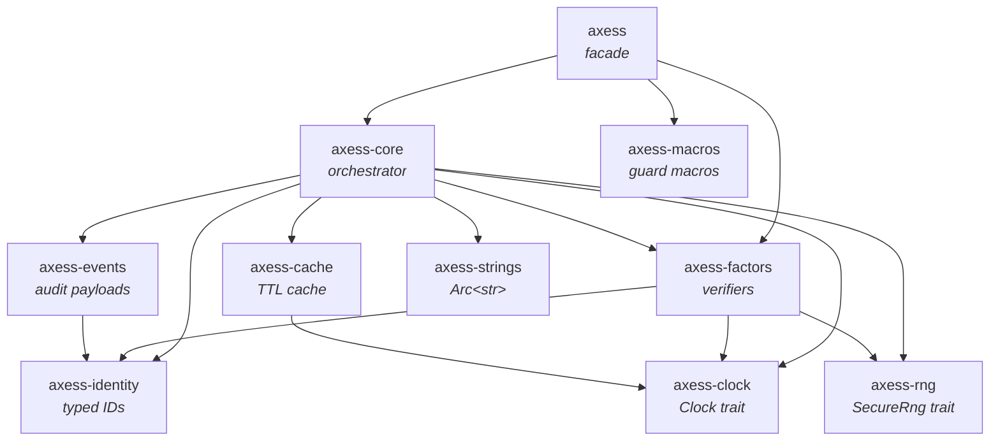
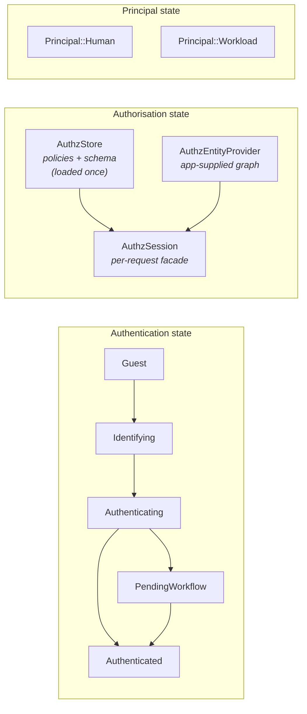

# Architecture at a glance

This chapter describes the shape of the axess workspace: which crate
owns what, how the pieces compose, what stays put under which kind of
change, and where adopters plug in. The goal is to make the rest of the
book pre-cached. Once you have the four architectural decisions below
in mind (the verifier-versus-orchestrator line, the three state slices,
the DST foundation, and the naming conventions), every later chapter
slots into place without further explanation.

If you are evaluating axess, read this chapter end-to-end. If you are
already mid-integration, you can skim and come back when something
feels surprising.

## Workspace shape

Axess is ten library crates plus a set of example applications. The split
is not cosmetic. It enforces a structural invariant (leaf crates do not
depend on the orchestrator), it gates compile cost for features
adopters do not use, and it makes the verifier-versus-orchestrator line
explicit in the dependency graph.



The `axess` crate is a thin facade that re-exports the curated public
API from `axess-core` and `axess-factors`. Application code depends on
this crate and only this crate. The internal split is free to
reorganise without breaking adopters, provided the types surfaced at
the facade level stay compatible.

`axess-core` is the orchestrator. It owns the session state machine,
`AuthnService`, `AuthzStore`, the Axum middleware stack (CSRF, rate
limit, request id, trace id), session storage backends, the
device-identity ladder, the workload identity resolvers, and the audit
dispatch. If a type drives a transition or owns persistent state, it
lives here.

`axess-factors` holds the per-credential verifiers. The list is long
because the credential surface authentication actually has is long:
Argon2id, TOTP, HOTP, email OTP, FIDO2, LDAP bind, mTLS, OAuth and OIDC
(with discovery, JWKS cache, and logout-token claim validation), JWT
validation, federation adapters for Kubernetes service accounts and
GitHub Actions and generic OAuth resource servers, a bearer-token
extractor, an outbound OAuth client, and the PKCE helpers. The crate is
composable on its own and is the obvious extension point when you need
a custom factor: implement the verifier trait, register it with the
service, the rest stays the same.

Everything else in the workspace is a leaf. Each leaf crate owns one
concept (typed IDs, TTL cache, the Clock trait), and depends only on
other leaves on its own row of the dependency graph. The structural
invariant under review is straightforward: no leaf crate may depend on
`axess-core`. Flipping any of these to depend on the orchestrator would
create a cycle through the facade and is rejected at review.

## The verifier-versus-orchestrator line

The most important line in the workspace runs between `axess-factors`
and `axess-core`. Per-credential algorithms and their data shapes live
on the verifier side. The sum types and the composition machinery that
combine them live on the orchestrator side.

This is concrete. The `Fido2Config` struct, the `Fido2Verifier` trait,
and the WebAuthn ceremony itself live in `axess-factors`. The
`FactorKind::Fido2` variant, the `FactorConfig::Fido2(Fido2Config)`
wrapping, and the `FactorStep::factor(FactorKind::Fido2)` composition
helper live in `axess-core`. The same pattern applies to LDAP, to OAuth,
to every factor: the algorithm and its config are verifier-side, the
enum variant and the composition are orchestrator-side.

The reason for the line is the kind of change each side absorbs. The
verifier is the thing you might want to swap (an alternative WebAuthn
library, a custom OTP scheme, an LDAP binding that reads from a sidecar
rather than directly). The orchestrator is the thing you do not swap
(the state machine, the audit dispatch, the storage interface) but do
want to extend (add a factor, add a workflow, add a backend). Keeping
the two in separate crates makes the swap and the extension into
independent operations. A change in `axess-factors` does not invalidate
orchestrator code; a change in `axess-core` does not touch the verifier
crates.

The line also shows up in the dependency direction. `axess-core`
depends on `axess-factors`, never the reverse.

## The one exception that proves the rule

`axess-core` hosts one piece of code that does not fit the
RP-side-orchestrator framing: the in-process IdP under
`crate::local_idp` (feature `local-idp`, off by default). `LocalIdp`
mints workload-identity JWTs on-host, which is OP-side issuance, not
verifier composition. It lives in `axess-core` deliberately, not by
oversight. The choice is between two costs: carve `LocalIdp` into a
sibling crate that mirrors the verifier/issuer split at workspace
shape, or accept one feature-gated OP-side module inside the
orchestrator crate. The carve-out has been considered (see the
ROADMAP) and rejected on the same reasoning that retired the earlier
`axess-delegated` crate: the structural benefit is real but small,
the maintenance overhead of an additional workspace member is real,
and no adopter is asking for `LocalIdp` as a separate dependency.
Adopters who do not enable `local-idp` pay nothing for it; adopters
who do enable it find it through `axess::local_idp::*` regardless of
which crate hosts the implementation.

The internal layout reflects the boundary even when the crate
boundary does not. Primitives shared between the production
[`LocalIdp`] and the test [`LocalIdpFixture`] live in
`axess-core/src/local_idp/primitives.rs`, outside the `testing/`
tree, so production code does not have to import from a test module.
The fixture itself stays under `crate::testing::local_idp` and
imports the primitives, which is the dependency direction the prior
arrangement got backwards.

## The three state slices

Most authentication libraries conflate three independent state machines
into one bag of fields and call the result a "session". Axess keeps
them separate. This is not a stylistic choice; the slices answer
different questions, change on different cadences, and are owned by
different concerns.



*Authentication state* is `AuthState`, the session state machine
covered in Part II. It transitions through factor verification, lives
inside `SessionData` behind a cookie, and is what `AuthnService::verify_factor`
mutates. It answers the question *"is this caller authenticated, and to
what tier?"* It changes on factor verification, which is rare in
absolute terms.

*Authorisation state* is `AuthzStore`, holding the Cedar policy set and
its schema, loaded once at startup. A per-request `AuthzSession` then
evaluates those policies against an entity graph that the application
supplies through an `AuthzEntityProvider`. It does not live in the
session; it is rebuilt fresh per request. It answers the question
*"is this principal allowed to perform this action against this
resource?"* It changes when policies are redeployed, which is even
rarer.

*Principal state* is `Principal { Human | Workload }`. A human
principal carries a `UserId` and `TenantId`; a workload principal
carries a `WorkloadId`. The principal is extracted from the
authentication state for humans and from a workload-identity resolver
(bearer JWT, mTLS, K8s service account, and so on) for non-humans. It
changes on every single request.

The slices are independent because they answer different questions and
change on different cadences. Treating them as one bag conflates the
questions and the cadences. Keeping them apart lets each evolve without
disturbing the others.

## Deterministic simulation testing

Every place in axess that reads wall time or sources entropy on the hot
path goes through an injected trait. This is the discipline that lets
the test suite be reproducible and that lets subtle timing or ordering
bugs become failing tests rather than rare incidents.

Two traits carry the foundation. The first is `Clock`:

```rust,ignore
pub trait Clock: Send + Sync {
    fn now(&self) -> chrono::DateTime<chrono::Utc>;
}

pub struct SystemClock;          // delegates to chrono::Utc::now()
pub struct MockClock { /* ... */ } // advances under test control
```

The second is `SecureRng`:

```rust,ignore
pub trait SecureRng: Send + Sync {
    fn fill_bytes(&self, dest: &mut [u8]);
}

pub struct SystemRng;          // delegates to getrandom
pub struct MockRng { /* ... */ } // seeded; reproduces byte sequence
```

A small detail matters here. `SecureRng::fill_bytes` takes `&self`, not
`&mut self`. The mock implementation guards its internal counter with a
`Mutex` so that `Arc<dyn SecureRng>` is dyn-compatible and concurrent
use is serialised without forcing every call site to plumb a mutable
borrow through. The trade is a single locked critical section per
random fill, which is irrelevant on the authentication hot path.

The wiring matches. `AuthnService<I, F>` holds `Arc<dyn SecureRng>` and
`Arc<dyn Clock>` as construction-time fields. The service is generic
over the identity store (`I`) and factor store (`F`) but type-erased
over clock and RNG, so swapping in `MockRng` or `MockClock` does not
change the service's type signature. Tests do this with
`.with_rng(MockRng::new(seed))` and `.with_clock(MockClock::default())`;
production wires `SystemRng` and `SystemClock`.

The same discipline extends to backends. The pattern is uniform: the
production implementation talks to a real database or external service,
and a `Mock*` implementation does the same thing in memory under test
control.

| Trait | Production implementation | Test mock |
|---|---|---|
| `AuthnBackend` | real database | `MockBackend` |
| `SessionRegistry` | Valkey or memory | `MemorySessionRegistry` |
| `OAuthProvider` | HTTP plus JWKS cache | `MockOAuthProvider` |
| `Fido2Provider` | WebAuthn ceremony | `MockFido2Provider` |
| `LdapProvider` | LDAP directory | `MockLdapProvider` |
| `DeviceStore` | SQL or Valkey | `MemoryDeviceStore` |
| `DeviceResolver` | header or IP | `RedactedResolver`, `NoopDeviceResolver` |

A complete login including session-registry interactions, factor
verification, refresh-token rotation, and audit emission can be
exercised in a `#[tokio::test]` with no database, no Valkey, no
network. The same test that detects a regression on a development
laptop detects it in CI without further configuration.

One carve-out is worth naming. The `axess-cache` crate has an opt-in
`moka-cache` feature that runs Moka's wall-clock-driven background
eviction. That feature breaks DST and is documented as breaking it.
The default `ClockTtlCache` takes a `Clock` trait and is DST-clean. If
your test suite runs against the default configuration, you are inside
the determinism envelope.

## Storage backends

Identity persistence is adopter-owned. Axess does not prescribe a user
or tenant or factor schema, because every application already has one
and the schemas do not agree on much. What axess does prescribe is the
trait surface you implement, split into three tiers so that adopters
can narrow what they have to write.

The narrowest tier is `IdentityLookup`, with ten read verbs. It is
enough to support a read-replica path or a test fixture. The middle
tier, `IdentityAuthnLog: IdentityLookup`, adds four per-attempt audit
writes; it is required for production because lockout decisions depend
on the audit log. The widest tier, `IdentityAdmin: IdentityAuthnLog`,
adds nine verbs covering privileged provisioning, suspension, and GDPR
erasure, and is required for any control-plane surface.

The umbrella alias `IdentityStore: IdentityAdmin` preserves the
all-three-tiers shape for production backends. `NoopAuthnLog` is an
adapter that wraps an `IdentityLookup` and satisfies the
`IdentityAuthnLog` signature with a no-op, suitable for fixtures and
read-replica contexts. Production must implement `IdentityAuthnLog`
directly, however; the noop disables lockout, which is a security
posture you do not want by accident.

Session, refresh-token, and device storage have first-party backends
for the obvious targets:

| Trait | Memory | SQLite | Postgres | MySQL | Valkey |
|---|---|---|---|---|---|
| `SessionStore` | always-on | `sqlite` | `postgres` | `mysql` | `valkey` |
| `SessionRegistry` | always-on | (adopter) | (adopter) | (adopter) | `valkey` |
| `RefreshTokenStore` | always-on | adopter | adopter | adopter | adopter |
| `DeviceStore` | `device` | `device, sqlite` | `device, postgres` | (adopter) | `device, valkey` |
| `DelegatedCredentialStore` | always-on | adopter | adopter | adopter | adopter |

The word "adopter" means axess defines the trait and provides a memory
implementation; the SQL or Valkey-backed implementation is yours. The
chapter *Identity store implementation* walks through the pattern, and
`examples/sqlite/` ships a complete one.

Session backends are also re-exported through the facade under the
`axess::backends::{sqlite, postgres, mysql, valkey, memory}` namespace.
Application code writes `use axess::backends::sqlite::{SessionStore, DeviceStore}`
rather than stitching together flat `SqliteSessionStore`,
`SqlDeviceStoreError`, and similar symbols. The grouping is a facade
detail; backend module paths inside `axess-core` are internal.

### The generic `Store<K, V>` surface

All five session backends also implement the generic
`axess_core::store::Store<SessionId, SessionData>` trait. Adopters who
want a backend-agnostic key/value-with-TTL surface (test doubles,
generic operations endpoints, multi-backend deployments) can hold an
`Arc<dyn Store<…>>` or a generic `S: Store<…>` and dispatch uniformly.
`SessionStore` stays the primary surface for session-domain operations
(`cycle`, `find_sessions_for_user`) because those carry primitives the
generic `Store` deliberately omits.

A fully codec-parameterised `SqlStore<K, V, C: Codec<V>>` was evaluated
and rejected. The dialect-specific SQL bodies are too thin to justify
the `sqlx::Database` bound noise: only `ON CONFLICT` versus
`ON DUPLICATE KEY UPDATE` plus three placeholder styles differ. The
slice that does dedupe cleanly lives in
`session/storage/sql_helpers.rs`.

## Naming conventions

A reviewer reading axess code can predict a type's responsibility from
its prefix and suffix. The conventions are tight on purpose; they let
you scan a module index without reading any function bodies.

### Type prefixes

| Prefix | Scope | Examples |
|---|---|---|
| `Auth*` | Shared across authentication and authorisation | `AuthSession`, `AuthState`, `AuthEvent`, `AuthMethod`, `AuthPrincipal` |
| `Authn*` | Authentication only | `AuthnService`, `AuthnError`, `AuthnScope`, `AuthnBackend` |
| `Authz*` | Authorisation only | `AuthzStore`, `AuthzSession`, `AuthzDecision`, `AuthzError` |

`Auth*` is shared infrastructure. `Authn*` is what you reach for when
handling a login attempt. `Authz*` is what you reach for when deciding
whether a request may proceed. If you see a function that takes
`AuthSession` and returns `AuthzDecision`, you know without opening it
that it is bridging authentication state into authorisation evaluation.

### Type suffixes

| Suffix | Meaning |
|---|---|
| `*Outcome` | Multi-variant result from an authentication operation (`LoginOutcome`, `FactorOutcome`, `SignupOutcome`) |
| `*Decision` | Binary allow/deny verdict (`AuthzDecision`) |
| `*Config` | Configuration or parameters (`SessionConfig`, `TotpConfig`, `RateLimitConfig`) |
| `*Store` | Persistence trait or implementation (`SessionStore`, `IdentityStore`, `DeviceStore`) |
| `*Registry` | Session validity tracking (`SessionRegistry`, `MemorySessionRegistry`) |
| `*Provider` | External integration trait (`OAuthProvider`, `Fido2Provider`, `LdapProvider`) |
| `*Resolver` | Extract typed value from a request (`DeviceResolver`, `PrincipalResolver`) |
| `*Error` | Error type (`AuthnError`, `OAuthError`, `CryptoError`) |
| `*Builder` | Builder pattern (`SessionConfigBuilder`, `AuthEventBuilder`) |

The conventions are not retroactive style guides. They are how the
public surface is built today. New types adopt them; PR review catches
violations.

### Method verb conventions

| Verb | Semantics | Examples |
|---|---|---|
| `get_*` | Lookup by primary key, deterministic, O(1) | `get_user(id)` |
| `find_*` | Search by business criteria, may scan | `find_user(identifier, tenant)` |
| `load_*` / `save_*` | Deserialise / serialise persisted state | `load_factor(scope, kind)` |
| `begin_*` / `complete_*` | Multi-step ceremony start / finish | `begin_login()`, `complete_oauth_login()` |
| `verify_*` | Check a credential or assertion | `verify_factor()` |

If you read `find_user_by_email`, you know it may be O(n) and may miss.
If you read `get_user`, you know the id was already validated and the
call should succeed unless the user was deleted.

### Visibility

Internal types for cross-module use within `axess-core`
(`SessionHandle`, `SessionInner`, `LoadOutcome`, `FinalizeOutcome`)
are `pub(crate)`. The public API surface is defined by the re-exports
in `axess-core`'s `lib.rs` and the facade in `axess`'s `lib.rs`. The
default for new types is `pub(crate)`; promotion to `pub` requires
concrete demand.

## Security invariants

Three invariants run through every part of the workspace. They are not
advice; they are enforced by lints, by review, and in some cases by
the type system.

The first is `#![forbid(unsafe_code)]`, declared at the root of every
crate. There is no unsafe code in axess. There never will be unsafe
code in axess. If a future change needs it, the change goes elsewhere.

The second is constant-time comparison for any byte-level secret
check. HMAC cookie verification, TOTP code verification, OAuth CSRF
state, refresh-token device binding, session fingerprint: all of these
compare bytes through `subtle::ConstantTimeEq`. The alternative, `==`
on bytes, leaks timing information and is rejected at review.

The third is secret zeroization on drop. Password hashes are wrapped
in `ZeroizedString`. TOTP and HOTP shared secrets use `Zeroizing`. The
session signing key zeroes its bytes in its `Drop` impl. The
discipline is not perfect (an attacker with sufficient memory access
can still win), but the surface is reduced.

The full production posture, including integration requirements and
compliance touch-points, is in *Security posture*.

## What lives where, in one paragraph

If you read nothing else from this chapter: state machines, storage,
middleware, federation adapters, device identity, and OBO/delegated
access live in `axess-core`. Factor algorithm primitives (Argon2id,
TOTP, HOTP) live in `axess-factors`. Typed IDs and the principal
enum live in `axess-identity`. Anything that delegates to time or
randomness goes through `axess-clock` or `axess-rng`. Adopters
depend on the `axess` facade; the internal split is free to
reorganise behind that boundary.

Everything else is detail. The rest of the book is detail.

## Further reading

- *The session state machine* covers the five-state machine in full,
  including `PendingWorkflow`.
- *Factors and methods* covers verifier composition, method authoring,
  and the scope hierarchy.
- *Cedar policy fundamentals* covers policy loading, the evaluator,
  and the entity provider contract.
- *Session lifecycle and crypto envelope* covers the cookie shape, the
  AES-256-GCM envelope, and fingerprint binding.
- *Contributing* covers the AX-NNN policy, the DST non-negotiable,
  and the naming conventions tied back to this chapter.
